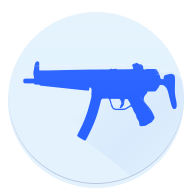

# UnCSO2



[](https://ci.appveyor.com/project/L-Leite/uncso2/branch/master)

A file data extractor for the videogames Counter Strike: Online 2 and Titanfall Online, for Windows and GNU/Linux.

It uses ekey's reversing work published at [XeNTaX's forums](https://forum.xentax.com/viewtopic.php?f=21&t=11117).

The program layout is based off KDE's Ark.

It uses [libuncso2](https://github.com/L-Leite/libuncso2) as the back-end library.

## Download 
You may download the latest build of UnCSO2 [here](https://github.com/L-Leite/UnCSO2/releases/latest).

## Features

Aside from extracting files from Counter-Strike: Online 2's and Titanfall Online's proprietary archive format, PKG, UnCSO2 can:

- Explore and extract from individual PKG archives;
- Explore and extract from entire game's filesystems (loads every PKG archive in their PKG index);
- Preview and/or extract individual file entries;
- Decrypt Counter-Strike: Online 2 files with an `.e*` prepended in their extension;
- Decompress Counter-Strike: Online 2 texture files.

### Compatible CSO2 regions

UnCSO2 **supports every Counter-Strike: Online 2 region**'s game data.

Those regions are: South Korea, China, Taiwan and Japan.

## Building

### Requirements
- [CMake](https://cmake.org/download/) (must be in PATH);
- [Qt 5.13](https://www.qt.io/download);
- A C++17 compiler with `std::filesystem` support.

#### With Visual Studio

You can generate project files for Visual Studio 15 by running the follwing commands:

```sh
# Create and go to the build directory
mkdir build
cd build

# Generate oroject files
cmake -G "Visual Studio 15 2017" -A "x64" ../
```

You can then build the solution file `uc2.sln`.

#### With other compilers

You can use the following the command to generate Ninja files for your compiler:

(With GCC as example)

```sh
# Create and go to the build directory
mkdir build
cd build

# Generate ninja files
cmake -G "Ninja" `
        -DCMAKE_CXX_COMPILER="g++" `
        -DCMAKE_C_COMPILER="gcc" `
        -DCMAKE_BUILD_TYPE="Release" `
        ../

# To build the project
ninja all
```

## Libraries used

UnCSO2 uses the following libraries:

- [GSL Lite](https://github.com/martinmoene/gsl-lite), MIT license.
- [Breeze Icon Theme](https://cgit.kde.org/breeze-icons.git/), LGPL.

libuncso2 also depends on libraries, see [libuncso2's used libraries](https://github.com/L-Leite/libuncso2/blob/master/README.md#libraries-used) for more information.

## License

UnCSO2 is distributed under the GNU GPLv3 license.

In the previous 1.* versions, UnCSO2 is distributed under the MIT license.
